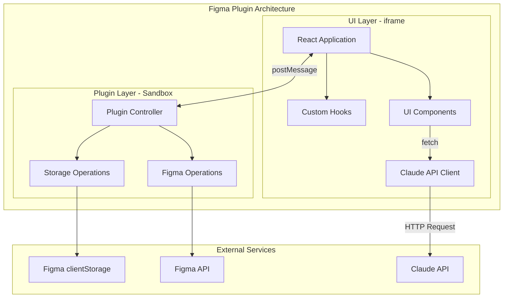
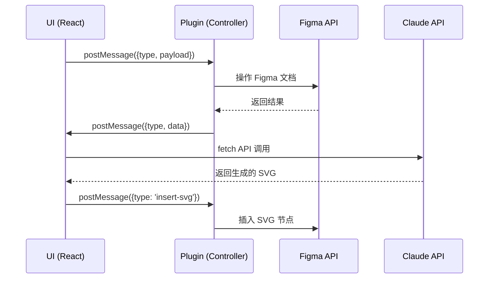
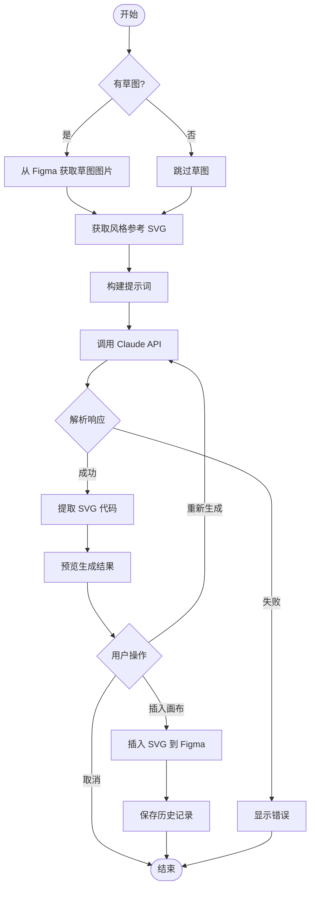
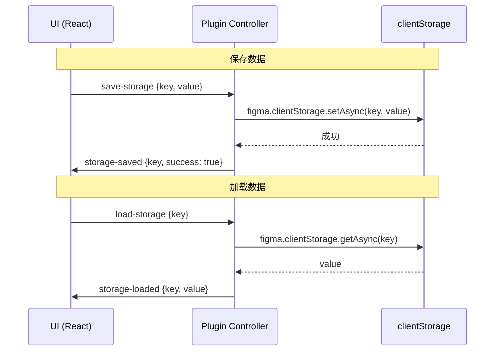

# Figma AI 图标生成插件 - 软件设计文档 (SDD)

## 文档信息

| 项目 | 内容 |
|------|------|
| 产品名称 | AI Icon Generator |
| 版本 | v1.0.0 |
| 创建日期 | 2024-12 |
| 技术栈 | React 19 + TypeScript + Tailwind CSS 4 + Figma Plugin API |

---

## 1. 系统架构

### 1.1 架构概览

Figma 插件由两个隔离的运行时环境组成：



### 1.2 运行时环境说明

| 环境 | 位置 | 能力 | 限制 |
|------|------|------|------|
| **UI (iframe)** | `src/app/` | DOM、fetch、React、浏览器 API | 无法访问 Figma API |
| **Plugin (Sandbox)** | `src/plugin/` | Figma API、clientStorage | 无法访问 DOM、fetch |

### 1.3 通信机制



---

## 2. 目录结构

```
src/
├── app/                          # UI 层 (React)
│   ├── index.tsx                 # 入口文件
│   ├── index.html                # HTML 模板
│   ├── components/
│   │   ├── App.tsx               # 主应用组件
│   │   ├── tabs/                 # 标签页组件
│   │   │   ├── GenerateTab.tsx   # 生成标签页
│   │   │   ├── LibraryTab.tsx    # 参考库标签页
│   │   │   ├── TemplatesTab.tsx  # 模板标签页
│   │   │   └── HistoryTab.tsx    # 历史标签页
│   │   ├── features/             # 功能组件
│   │   │   ├── SketchPreview.tsx # 草图预览
│   │   │   ├── StyleRefSelector.tsx # 风格参考选择器
│   │   │   ├── GenerateResult.tsx   # 生成结果
│   │   │   └── SettingsDialog.tsx   # 设置弹窗
│   │   └── ui/                   # shadcn/ui 组件
│   │       ├── button.tsx
│   │       ├── card.tsx
│   │       ├── input.tsx
│   │       ├── tabs.tsx
│   │       ├── dialog.tsx
│   │       └── ...
│   ├── hooks/                    # 自定义 Hooks
│   │   ├── usePluginMessage.ts   # 插件消息监听
│   │   ├── useStorage.ts         # 存储操作
│   │   └── useClaudeAPI.ts       # Claude API 调用
│   ├── lib/
│   │   ├── utils.ts              # 工具函数
│   │   ├── api.ts                # API 客户端
│   │   └── prompts.ts            # 提示词模板
│   ├── stores/                   # 状态管理 (可选使用 zustand)
│   │   └── appStore.ts
│   ├── styles/
│   │   └── ui.css                # Tailwind 样式
│   └── assets/
│       └── logo.svg
├── plugin/                       # Plugin 层
│   └── controller.ts             # 插件控制器
└── typings/
    └── types.d.ts                # 类型定义
```

---

## 3. 数据模型

### 3.1 核心数据类型

```typescript
// src/typings/types.d.ts

/** API Key 配置 */
interface APIConfig {
  apiKey: string;
  baseUrl?: string; // 可选，用于自定义 API 端点
}

/** 风格参考 */
interface StyleReference {
  id: string;
  name: string;
  description?: string;
  svgCode: string;
  thumbnail?: string; // Base64 缩略图
  createdAt: number;
  updatedAt: number;
}

/** 草图数据 */
interface SketchData {
  imageBase64: string; // 草图图片的 Base64
  width: number;
  height: number;
  sourceNodeId?: string; // 来源 Figma 节点 ID
}

/** 提示词模板 */
interface PromptTemplate {
  id: string;
  name: string;
  description?: string;
  template: string; // 包含 {theme} 等占位符
  isPreset: boolean; // 是否为预设模板
  createdAt: number;
}

/** 生成请求 */
interface GenerateRequest {
  sketch?: SketchData;
  styleRefs: StyleReference[];
  theme: string;
  customPrompt?: string;
  outputWidth: number;
  outputHeight: number;
}

/** 生成结果 */
interface GenerateResult {
  svgCode: string;
  width: number;
  height: number;
}

/** 历史记录 */
interface HistoryRecord {
  id: string;
  request: GenerateRequest;
  result: GenerateResult;
  createdAt: number;
}

/** 应用存储数据 */
interface AppStorageData {
  apiConfig?: APIConfig;
  styleRefs: StyleReference[];
  templates: PromptTemplate[];
  history: HistoryRecord[];
  settings: {
    defaultWidth: number;
    defaultHeight: number;
  };
}
```

### 3.2 消息类型定义

```typescript
// src/typings/types.d.ts

/** UI → Plugin 消息 */
type UIToPluginMessage =
  | { type: 'get-selection-as-svg' }
  | { type: 'get-selection-as-image' }
  | { type: 'insert-svg'; svgCode: string }
  | { type: 'load-storage'; key: keyof AppStorageData }
  | { type: 'save-storage'; key: keyof AppStorageData; value: unknown }
  | { type: 'resize-ui'; width: number; height: number }
  | { type: 'notify'; message: string; options?: NotificationOptions };

/** Plugin → UI 消息 */
type PluginToUIMessage =
  | { type: 'selection-svg'; svgCode: string | null; error?: string }
  | { type: 'selection-image'; imageBase64: string | null; width: number; height: number; error?: string }
  | { type: 'svg-inserted'; success: boolean; error?: string }
  | { type: 'storage-loaded'; key: string; value: unknown }
  | { type: 'storage-saved'; key: string; success: boolean }
  | { type: 'selection-changed'; hasSelection: boolean; count: number };

/** 通用消息类型 */
type PluginMessage = UIToPluginMessage | PluginToUIMessage;
```

---

## 4. 模块设计

### 4.1 Plugin Controller (src/plugin/controller.ts)

```typescript
// 核心职责：
// 1. 处理 UI 发送的消息
// 2. 操作 Figma API
// 3. 管理 clientStorage

// 主要函数

/** 初始化插件 */
function initPlugin(): void {
  figma.showUI(__html__, { width: 360, height: 600 });
  setupMessageHandlers();
  setupSelectionListener();
}

/** 设置消息处理器 */
function setupMessageHandlers(): void {
  figma.ui.onmessage = async (msg: UIToPluginMessage) => {
    switch (msg.type) {
      case 'get-selection-as-svg':
        await handleGetSelectionAsSVG();
        break;
      case 'get-selection-as-image':
        await handleGetSelectionAsImage();
        break;
      case 'insert-svg':
        await handleInsertSVG(msg.svgCode);
        break;
      case 'load-storage':
        await handleLoadStorage(msg.key);
        break;
      case 'save-storage':
        await handleSaveStorage(msg.key, msg.value);
        break;
      // ... 其他消息处理
    }
  };
}

/** 获取选中内容的 SVG */
async function handleGetSelectionAsSVG(): Promise<void> {
  const selection = figma.currentPage.selection;
  if (selection.length === 0) {
    figma.ui.postMessage({ type: 'selection-svg', svgCode: null, error: 'No selection' });
    return;
  }
  
  try {
    const node = selection[0];
    const svgCode = await node.exportAsync({ format: 'SVG_STRING' });
    figma.ui.postMessage({ type: 'selection-svg', svgCode });
  } catch (error) {
    figma.ui.postMessage({ type: 'selection-svg', svgCode: null, error: String(error) });
  }
}

/** 获取选中内容的图片 (用于草图) */
async function handleGetSelectionAsImage(): Promise<void> {
  const selection = figma.currentPage.selection;
  if (selection.length === 0) {
    figma.ui.postMessage({ type: 'selection-image', imageBase64: null, width: 0, height: 0, error: 'No selection' });
    return;
  }
  
  try {
    const node = selection[0];
    const bytes = await node.exportAsync({ format: 'PNG', constraint: { type: 'SCALE', value: 2 } });
    const imageBase64 = figma.base64Encode(bytes);
    figma.ui.postMessage({
      type: 'selection-image',
      imageBase64,
      width: node.width,
      height: node.height
    });
  } catch (error) {
    figma.ui.postMessage({ type: 'selection-image', imageBase64: null, width: 0, height: 0, error: String(error) });
  }
}

/** 插入 SVG 到画布 */
async function handleInsertSVG(svgCode: string): Promise<void> {
  try {
    const node = figma.createNodeFromSvg(svgCode);
    figma.currentPage.appendChild(node);
    figma.currentPage.selection = [node];
    figma.viewport.scrollAndZoomIntoView([node]);
    figma.ui.postMessage({ type: 'svg-inserted', success: true });
    figma.notify('图标已插入画布');
  } catch (error) {
    figma.ui.postMessage({ type: 'svg-inserted', success: false, error: String(error) });
    figma.notify('插入失败: ' + String(error), { error: true });
  }
}

/** 监听选中变化 */
function setupSelectionListener(): void {
  figma.on('selectionchange', () => {
    const selection = figma.currentPage.selection;
    figma.ui.postMessage({
      type: 'selection-changed',
      hasSelection: selection.length > 0,
      count: selection.length
    });
  });
}
```

### 4.2 UI Hooks

#### usePluginMessage Hook

```typescript
// src/app/hooks/usePluginMessage.ts
import { useEffect, useCallback } from 'react';

type MessageHandler<T> = (data: T) => void;

export function usePluginMessage<T extends PluginToUIMessage>(
  type: T['type'],
  handler: MessageHandler<T>
): void {
  const stableHandler = useCallback(handler, [handler]);
  
  useEffect(() => {
    const handleMessage = (event: MessageEvent) => {
      const msg = event.data.pluginMessage;
      if (msg?.type === type) {
        stableHandler(msg as T);
      }
    };
    
    window.addEventListener('message', handleMessage);
    return () => window.removeEventListener('message', handleMessage);
  }, [type, stableHandler]);
}

/** 发送消息给 Plugin */
export function postToPlugin(message: UIToPluginMessage): void {
  parent.postMessage({ pluginMessage: message }, '*');
}
```

#### useClaudeAPI Hook

```typescript
// src/app/hooks/useClaudeAPI.ts
import { useState, useCallback } from 'react';

interface UseClaudeAPIReturn {
  generate: (request: GenerateRequest, apiKey: string) => Promise<GenerateResult>;
  isLoading: boolean;
  error: string | null;
}

export function useClaudeAPI(): UseClaudeAPIReturn {
  const [isLoading, setIsLoading] = useState(false);
  const [error, setError] = useState<string | null>(null);

  const generate = useCallback(async (
    request: GenerateRequest,
    apiKey: string
  ): Promise<GenerateResult> => {
    setIsLoading(true);
    setError(null);
    
    try {
      const prompt = buildPrompt(request);
      const response = await callClaudeAPI(apiKey, prompt, request.sketch?.imageBase64);
      const svgCode = extractSVGFromResponse(response);
      
      return {
        svgCode,
        width: request.outputWidth,
        height: request.outputHeight
      };
    } catch (err) {
      const errorMessage = err instanceof Error ? err.message : 'Unknown error';
      setError(errorMessage);
      throw err;
    } finally {
      setIsLoading(false);
    }
  }, []);

  return { generate, isLoading, error };
}
```

### 4.3 Claude API 集成

```typescript
// src/app/lib/api.ts

const CLAUDE_API_URL = 'https://api.anthropic.com/v1/messages';

interface ClaudeMessage {
  role: 'user' | 'assistant';
  content: ClaudeContent[];
}

type ClaudeContent = 
  | { type: 'text'; text: string }
  | { type: 'image'; source: { type: 'base64'; media_type: string; data: string } };

interface ClaudeRequest {
  model: string;
  max_tokens: number;
  messages: ClaudeMessage[];
}

interface ClaudeResponse {
  content: { type: 'text'; text: string }[];
}

export async function callClaudeAPI(
  apiKey: string,
  prompt: string,
  imageBase64?: string
): Promise<string> {
  const content: ClaudeContent[] = [];
  
  // 添加图片（草图）
  if (imageBase64) {
    content.push({
      type: 'image',
      source: {
        type: 'base64',
        media_type: 'image/png',
        data: imageBase64
      }
    });
  }
  
  // 添加文本提示词
  content.push({ type: 'text', text: prompt });
  
  const requestBody: ClaudeRequest = {
    model: 'claude-sonnet-4-20250514',
    max_tokens: 4096,
    messages: [{ role: 'user', content }]
  };
  
  const response = await fetch(CLAUDE_API_URL, {
    method: 'POST',
    headers: {
      'Content-Type': 'application/json',
      'x-api-key': apiKey,
      'anthropic-version': '2023-06-01',
      'anthropic-dangerous-direct-browser-access': 'true'
    },
    body: JSON.stringify(requestBody)
  });
  
  if (!response.ok) {
    const error = await response.json();
    throw new Error(error.error?.message || 'API request failed');
  }
  
  const data: ClaudeResponse = await response.json();
  return data.content[0].text;
}

/** 从 Claude 响应中提取 SVG 代码 */
export function extractSVGFromResponse(response: string): string {
  // 尝试匹配 ```svg ... ``` 代码块
  const codeBlockMatch = response.match(/```(?:svg|xml)?\s*([\s\S]*?)```/);
  if (codeBlockMatch) {
    return codeBlockMatch[1].trim();
  }
  
  // 尝试直接匹配 <svg> 标签
  const svgMatch = response.match(/<svg[\s\S]*?<\/svg>/i);
  if (svgMatch) {
    return svgMatch[0];
  }
  
  throw new Error('No SVG found in response');
}
```

### 4.4 提示词工程

```typescript
// src/app/lib/prompts.ts

/** 构建生成提示词 */
export function buildPrompt(request: GenerateRequest): string {
  const { styleRefs, theme, customPrompt, outputWidth, outputHeight } = request;
  
  let prompt = '';
  
  // 添加风格参考
  if (styleRefs.length > 0) {
    prompt += '参考以下 SVG 的风格（保持配色、渐变、描边等细节）：\n\n';
    styleRefs.forEach((ref, index) => {
      prompt += `【参考 ${index + 1}: ${ref.name}】\n`;
      prompt += '```svg\n' + ref.svgCode + '\n```\n\n';
    });
  }
  
  // 添加草图说明
  if (request.sketch) {
    prompt += '根据附件中的草图生成插图。保持草图的构图和元素布局。\n\n';
  }
  
  // 添加主题描述
  prompt += `主题是："${theme}"\n\n`;
  
  // 添加自定义提示词
  if (customPrompt) {
    prompt += `其他要求：${customPrompt}\n\n`;
  }
  
  // 添加输出要求
  prompt += `请生成 ${outputWidth}x${outputHeight} 尺寸的 SVG 代码。\n`;
  prompt += '要求：\n';
  prompt += '- 使用参考 SVG 的设计语言和配色方案\n';
  prompt += '- 输出完整的、可直接使用的 SVG 代码\n';
  prompt += '- 确保 SVG 代码格式正确，可以被 Figma 解析\n';
  prompt += '- 只输出 SVG 代码，不需要其他解释\n';
  
  return prompt;
}

/** 预设提示词模板 */
export const PRESET_TEMPLATES: PromptTemplate[] = [
  {
    id: 'tech-icon',
    name: '科技风图标',
    description: '适合技术产品的科技感图标',
    template: '生成一个科技感的图标，主题是"{theme}"，使用渐变和光晕效果，现代简洁',
    isPreset: true,
    createdAt: Date.now()
  },
  {
    id: 'flat-icon',
    name: '扁平化图标',
    description: '简洁清晰的扁平化风格',
    template: '生成一个扁平化风格的图标，主题是"{theme}"，简洁清晰，无渐变无阴影',
    isPreset: true,
    createdAt: Date.now()
  },
  {
    id: 'illustration',
    name: '插画风格',
    description: '适合营销页面的活泼插画',
    template: '生成一个插画风格的图形，主题是"{theme}"，活泼有趣，色彩丰富',
    isPreset: true,
    createdAt: Date.now()
  },
  {
    id: 'line-icon',
    name: '线性图标',
    description: '统一线条粗细的线性图标',
    template: '生成一个线性图标，主题是"{theme}"，线条粗细统一，简约优雅',
    isPreset: true,
    createdAt: Date.now()
  },
  {
    id: 'isometric',
    name: '等距图标',
    description: '2.5D 等距视角图标',
    template: '生成一个等距（2.5D）风格的图标，主题是"{theme}"，有立体感和深度',
    isPreset: true,
    createdAt: Date.now()
  }
];
```

---

## 5. 核心流程

### 5.1 图标生成流程



### 5.2 风格参考添加流程

```mermaid
flowchart TD
    Start([开始]) --> SelectNode[用户选中 Figma 节点]
    SelectNode --> ClickAdd[点击"添加到参考库"]
    
    ClickAdd --> SendMsg[UI 发送 get-selection-as-svg 消息]
    SendMsg --> PluginExport[Plugin 导出 SVG]
    
    PluginExport --> CheckResult{导出成功?}
    CheckResult -->|是| SendSVG[返回 SVG 代码给 UI]
    CheckResult -->|否| ShowError[显示错误提示]
    
    SendSVG --> ShowDialog[显示编辑弹窗]
    ShowDialog --> UserInput[用户输入名称和描述]
    UserInput --> SaveRef[保存到风格参考库]
    
    SaveRef --> UpdateStorage[更新 clientStorage]
    UpdateStorage --> RefreshList[刷新参考列表]
    RefreshList --> End([结束])
    
    ShowError --> End
```

### 5.3 数据存储流程



---

## 6. UI 组件设计

### 6.1 组件层次结构

```
App
├── Header
│   ├── Logo
│   └── SettingsButton
├── TabNavigation
│   ├── GenerateTab (default)
│   ├── LibraryTab
│   ├── TemplatesTab
│   └── HistoryTab
└── TabContent
    ├── GeneratePanel
    │   ├── SketchPreview
    │   ├── StyleRefSelector
    │   ├── ThemeInput
    │   ├── SizeSettings
    │   ├── GenerateButton
    │   └── GenerateResult
    ├── LibraryPanel
    │   ├── AddRefButton
    │   ├── StyleRefList
    │   └── StyleRefCard
    ├── TemplatesPanel
    │   ├── TemplateList
    │   ├── TemplateCard
    │   └── AddTemplateDialog
    └── HistoryPanel
        ├── HistoryList
        ├── HistoryCard
        └── HistoryDetailDialog
```

### 6.2 状态管理

使用 React 内置状态管理（useState/useReducer），如需更复杂状态可考虑 zustand：

```typescript
// src/app/stores/appStore.ts (可选，使用 zustand)
import { create } from 'zustand';

interface AppState {
  // API 配置
  apiKey: string | null;
  setApiKey: (key: string) => void;
  
  // 风格参考
  styleRefs: StyleReference[];
  addStyleRef: (ref: StyleReference) => void;
  removeStyleRef: (id: string) => void;
  
  // 选中的参考
  selectedRefIds: string[];
  toggleRefSelection: (id: string) => void;
  
  // 草图
  sketch: SketchData | null;
  setSketch: (sketch: SketchData | null) => void;
  
  // 生成状态
  isGenerating: boolean;
  generateResult: GenerateResult | null;
  
  // 历史记录
  history: HistoryRecord[];
  addHistory: (record: HistoryRecord) => void;
}

export const useAppStore = create<AppState>((set) => ({
  apiKey: null,
  setApiKey: (key) => set({ apiKey: key }),
  
  styleRefs: [],
  addStyleRef: (ref) => set((state) => ({ 
    styleRefs: [...state.styleRefs, ref] 
  })),
  removeStyleRef: (id) => set((state) => ({
    styleRefs: state.styleRefs.filter(r => r.id !== id)
  })),
  
  selectedRefIds: [],
  toggleRefSelection: (id) => set((state) => ({
    selectedRefIds: state.selectedRefIds.includes(id)
      ? state.selectedRefIds.filter(i => i !== id)
      : [...state.selectedRefIds, id]
  })),
  
  sketch: null,
  setSketch: (sketch) => set({ sketch }),
  
  isGenerating: false,
  generateResult: null,
  
  history: [],
  addHistory: (record) => set((state) => ({
    history: [record, ...state.history].slice(0, 50) // 最多保存 50 条
  }))
}));
```

---

## 7. 错误处理

### 7.1 错误类型

```typescript
// src/app/lib/errors.ts

export enum ErrorCode {
  NO_SELECTION = 'NO_SELECTION',
  EXPORT_FAILED = 'EXPORT_FAILED',
  API_KEY_MISSING = 'API_KEY_MISSING',
  API_KEY_INVALID = 'API_KEY_INVALID',
  API_REQUEST_FAILED = 'API_REQUEST_FAILED',
  API_RATE_LIMITED = 'API_RATE_LIMITED',
  SVG_PARSE_FAILED = 'SVG_PARSE_FAILED',
  SVG_INSERT_FAILED = 'SVG_INSERT_FAILED',
  STORAGE_ERROR = 'STORAGE_ERROR'
}

export const ERROR_MESSAGES: Record<ErrorCode, string> = {
  [ErrorCode.NO_SELECTION]: '请先在 Figma 中选择一个元素',
  [ErrorCode.EXPORT_FAILED]: '导出失败，请检查选中的元素',
  [ErrorCode.API_KEY_MISSING]: '请先配置 Claude API Key',
  [ErrorCode.API_KEY_INVALID]: 'API Key 无效，请检查后重试',
  [ErrorCode.API_REQUEST_FAILED]: 'API 请求失败，请稍后重试',
  [ErrorCode.API_RATE_LIMITED]: 'API 请求过于频繁，请稍后重试',
  [ErrorCode.SVG_PARSE_FAILED]: 'AI 返回的内容无法解析为 SVG',
  [ErrorCode.SVG_INSERT_FAILED]: 'SVG 插入失败，代码可能有误',
  [ErrorCode.STORAGE_ERROR]: '数据存储失败'
};
```

### 7.2 错误处理策略

| 错误场景 | 处理方式 |
|---------|---------|
| 无选中元素 | 显示提示，引导用户选择 |
| API Key 缺失 | 跳转到设置页面 |
| API 请求失败 | 显示错误详情，提供重试按钮 |
| SVG 解析失败 | 显示原始响应，提供手动复制选项 |
| 插入失败 | 显示 SVG 代码，让用户手动粘贴 |

---

## 8. 安全考虑

### 8.1 API Key 安全

```typescript
// API Key 存储和使用原则

// 1. 存储：使用 Figma clientStorage，数据存储在用户本地
await figma.clientStorage.setAsync('apiConfig', { apiKey: '***' });

// 2. 传输：直接从 UI 层调用 Claude API，不经过任何中间服务器
// API Key 只在用户浏览器和 Claude API 之间传输

// 3. 显示：UI 中 API Key 输入框使用 password 类型
<input type="password" value={apiKey} />

// 4. 内存：不在全局变量中长期持有明文 API Key
```

### 8.2 数据隐私

- 用户的设计数据（SVG、草图图片）仅在以下范围传输：
  - Figma Plugin ↔ UI iframe（本地通信）
  - UI iframe ↔ Claude API（生成请求）
- 不会上传到任何第三方服务器
- 历史记录仅存储在本地 clientStorage

---

## 9. 性能优化

### 9.1 图片压缩

```typescript
// 草图图片导出时进行适当压缩
const bytes = await node.exportAsync({
  format: 'PNG',
  constraint: { 
    type: 'WIDTH', 
    value: Math.min(node.width, 800) // 限制最大宽度
  }
});
```

### 9.2 存储优化

```typescript
// 历史记录限制数量
const MAX_HISTORY_COUNT = 50;

function addHistory(record: HistoryRecord) {
  const history = [...currentHistory, record];
  if (history.length > MAX_HISTORY_COUNT) {
    history.splice(MAX_HISTORY_COUNT);
  }
  saveToStorage('history', history);
}

// 缩略图压缩
function generateThumbnail(svgCode: string): string {
  // 生成小尺寸缩略图用于列表显示
  // 完整 SVG 在详情中加载
}
```

### 9.3 请求防抖

```typescript
// 生成按钮防抖，避免重复请求
const [isGenerating, setIsGenerating] = useState(false);

async function handleGenerate() {
  if (isGenerating) return;
  setIsGenerating(true);
  try {
    await generate();
  } finally {
    setIsGenerating(false);
  }
}
```

---

## 10. 测试策略

### 10.1 单元测试

| 模块 | 测试内容 |
|------|---------|
| prompts.ts | 提示词构建正确性 |
| api.ts | SVG 提取正确性、错误处理 |
| utils.ts | 工具函数正确性 |

### 10.2 集成测试

| 场景 | 测试内容 |
|------|---------|
| 消息通信 | UI ↔ Plugin 消息收发 |
| 存储操作 | 数据存取正确性 |
| API 调用 | 请求响应处理 |

### 10.3 端到端测试

| 流程 | 测试内容 |
|------|---------|
| 完整生成流程 | 从选择草图到插入画布 |
| 参考库管理 | 添加、编辑、删除参考 |
| 历史记录 | 记录保存和复用 |

---

## 附录

### A. 技术栈版本

| 技术 | 版本 |
|------|------|
| React | 19.0.0 |
| TypeScript | 5.7.x |
| Tailwind CSS | 4.0.0 |
| Figma Plugin API | 1.50.0 |
| Claude API | 2023-06-01 |

### B. 参考文档

- [Figma Plugin API 文档](https://www.figma.com/plugin-docs/)
- [Claude API 文档](https://docs.anthropic.com/claude/reference/getting-started-with-the-api)
- [React 19 文档](https://react.dev/)
- [Tailwind CSS 4 文档](https://tailwindcss.com/docs)

### C. 开发命令

```bash
# 开发模式
pnpm dev

# 构建生产版本
pnpm build

# 类型检查
pnpm typecheck

# 代码检查
pnpm lint
pnpm lint:fix
```

